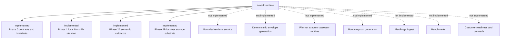
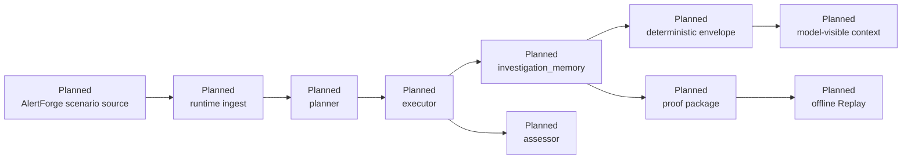
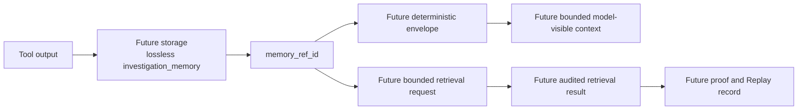
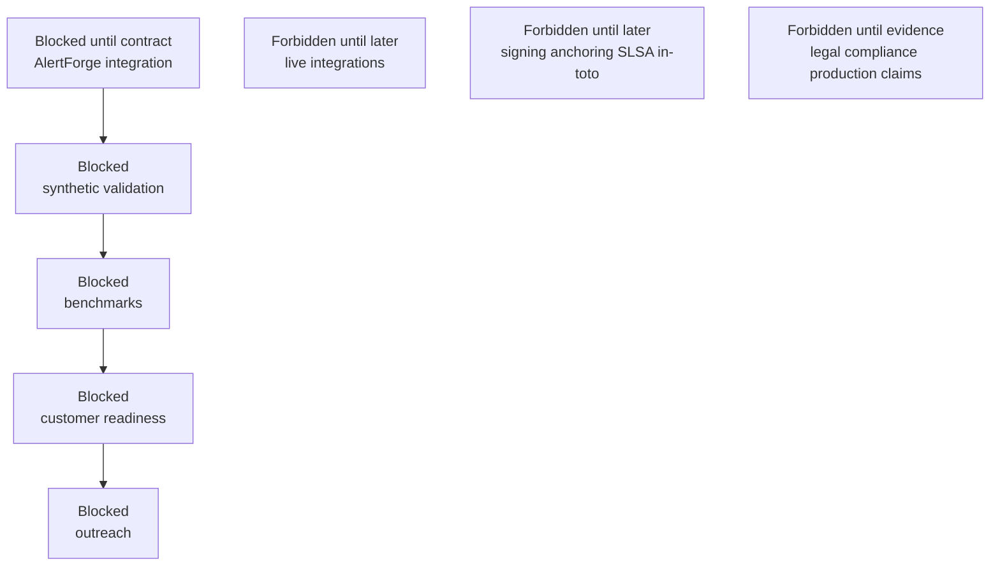

# Current System Diagram

Status: visual documentation only. These diagrams do not implement runtime
behavior.

## Diagram A: Current Implemented State

## Diagram B: Future Runtime Data Flow

All nodes in this diagram are future planned runtime behavior, not current
implementation.

## Diagram C: Context Compaction Memory Lifecycle

Phase 2B implements only the storage portion. Retrieval, envelope generation,
model-visible context, and proof/Replay recording remain later phases.

## Diagram D: Blocked Downstream Items

These items remain blocked or forbidden until separately scoped, implemented,
tested, and reviewed.
