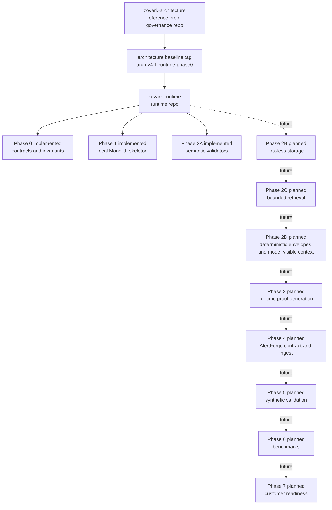
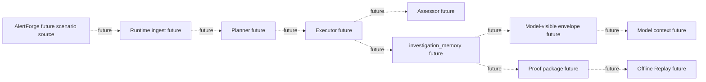

# Runtime Architecture Implementation Map

Status: documentation map only. This document does not implement storage,
retrieval, model context integration, proof generation, AlertForge integration,
benchmarks, customer-readiness, OCSF, RamaLama, signing, legal, or compliance
scope.

## Architecture Sources

This map is based on:

- `7inaydas-cmyk/zovark-architecture` tag
  `arch-v4.1-runtime-phase0`, commit
  `0f4582267ac2a63a90d4c218ad442765785ca63b`.
- Runtime repository `7inaydas-cmyk/zovark-runtime` main commit
  `40b5ced0df9e17d5826e75cd2f940f0a83cffda6`.
- Architecture files:
  - `docs/architecture-current-state.md`
  - `docs/context-compaction-memory.md`
  - `docs/contract-governance.md`
  - `contracts/README.md`
  - `docs/adr-status-table.md`
- Runtime files:
  - `README.md`
  - `PHASE_PLAN.md`
  - `INVARIANTS.md`
  - `ARCHITECTURE_REPO_SOURCE.md`

## Current Implementation State

| Area | State | Notes |
| --- | --- | --- |
| Phase 0 contracts/invariants | implemented | Contract snapshot, manifest check, and invariant text exist. |
| Phase 1 local Monolith skeleton | implemented | Status and doctor commands only. |
| Phase 2A semantic validators | implemented | In-memory semantic validation helpers only. |
| Phase 2B lossless storage | not implemented | No `investigation_memory` storage exists. |
| Bounded retrieval | not implemented | No retrieval service or retrieval execution exists. |
| Deterministic envelope generation | not implemented | Contracts exist; runtime envelope generation does not. |
| Runtime investigation planner/executor/assessor | not implemented | No investigation execution exists. |
| Proof generation from runtime state | not implemented | No runtime proof package generation exists. |
| AlertForge contract/ingest | not implemented | AlertForge remains future upstream scenario source. |
| Benchmarks | not implemented | No benchmark harness or claims exist. |
| Customer-readiness/outreach | not implemented | Outreach remains blocked until evidence-backed readiness. |
| OCSF implementation | not implemented | OCSF is not canonical and has no mapper or ingest path. |
| RamaLama/local inference implementation | not implemented | No live LLM or local inference integration exists. |

## Repository Relationship



## Future Runtime Data Flow



This diagram is a target flow. It is not implemented today.

## Phase Boundaries

Phase 2B should start as lossless storage only unless a later PR explicitly
approves more scope. Bounded retrieval, deterministic envelope/model-visible
context, runtime proof generation, AlertForge ingest, synthetic validation,
benchmarks, and customer-readiness remain separate later phases.

The Context Compaction Memory invariant remains:

```text
No model receives unbounded raw tool output.
```

This document is a map, not implementation.
